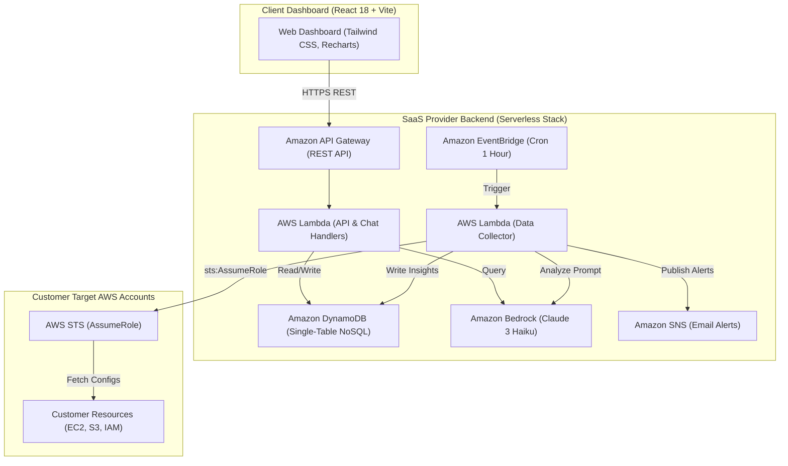

# Proposal: AI AWS Advisor (Enterprise SaaS)
## An Automated Multi-Tenant Cloud Audit & Optimization Platform

### 1. Executive Summary

The **AI AWS Advisor** platform is proposed as an enterprise-grade B2B SaaS platform designed to automate cloud infrastructure auditing, security compliance checks, and cost optimization for multi-account AWS environments. 

By leveraging **Amazon Bedrock (Claude 3 Haiku)** alongside a 100% Serverless architecture (**AWS Lambda, Amazon API Gateway, Amazon DynamoDB, Amazon EventBridge**), the system automatically collects raw AWS resource configurations, evaluates risks, calculates potential cost savings, and delivers actionable recommendations through an interactive web dashboard and AI Copilot.

---

### 2. Problem Statement

#### The Problem
Modern organizations running workloads on AWS face three major operational challenges:
1. **Security Vulnerabilities:** Misconfigurations such as publicly accessible S3 buckets, open security groups (`0.0.0.0/0`), and over-privileged IAM roles often go undetected until a security breach occurs.
2. **Cloud Resource Waste:** Unattached EBS volumes, idle EC2 instances, and unutilized Elastic IPs accumulate thousands of dollars in unnecessary monthly charges.
3. **High Audit Friction:** Security officers and DevOps engineers spend hundreds of hours manually inspecting complex JSON configurations across multiple accounts.

#### The Proposed Solution
**AI AWS Advisor** provides a unified, zero-trust cloud auditing solution:
- **Zero-Trust Cross-Account Delegation:** Uses AWS Security Token Service (`sts:AssumeRole`) to request temporary audit credentials without ever storing long-term customer Access Keys.
- **Automated Event-Driven Scanning:** EventBridge triggers hourly background sweeps to collect infrastructure configurations across all registered customer accounts.
- **Generative AI Analysis Engine:** Integrates Amazon Bedrock (Claude 3 Haiku) to translate unstructured JSON configurations into structured, prioritized insights categorized into **Security**, **Cost Optimization**, and **Performance**.
- **Real-Time AI Copilot:** Empowers users to query their infrastructure state in natural language via a built-in AI Chatbot.

#### Return on Investment (ROI) & Business Benefits
- **Time Savings:** Reduces manual audit duration by over 90% (from days to minutes).
- **Cost Reduction:** Typically identifies 15% to 35% in monthly AWS infrastructure savings for onboarded accounts.
- **Near-Zero Operating Overhead:** Operating costs scale with usage on a pay-as-you-go serverless model, with an estimated idle cost of $0.00/month.

---

### 3. Solution Architecture

The system is engineered into three isolated security zones:



#### AWS Managed Services Used
- **AWS Lambda:** Executes API endpoints, AI chat queries, and cron data collection.
- **Amazon API Gateway:** Provides secure, rate-limited REST endpoints for the frontend.
- **Amazon DynamoDB:** Single-Table NoSQL database storing projects, resource snapshots, and AI insights with partition-key tenant isolation.
- **Amazon Bedrock (Claude 3 Haiku):** Generative AI reasoning engine parsing raw AWS JSON into structured remediation plans.
- **Amazon EventBridge & SNS:** Cron scheduling for hourly audits and automated email alert notifications.
- **AWS STS:** Cross-account role delegation (`sts:AssumeRole`).

---

### 4. Technical Implementation Plan

#### Implementation Phases
1. **Phase 1: Security & Architecture Setup (Month 1):** Define Cross-Account IAM trust policies, set up AWS SAM CLI templates, and design the DynamoDB Single-Table schema (`PROJECTS`, `RESOURCES`, `INSIGHTS`, `ALERTS`).
2. **Phase 2: Core Scanner & Bedrock Integration (Month 2):** Implement `boto3` resource collectors, configure Amazon Bedrock Claude 3 prompt engineering, and write automated Pytest unit tests with `moto`.
3. **Phase 3: Frontend Dashboard & AI Chatbot (Month 3):** Develop React 18 frontend dashboard with Vite, Tailwind CSS, and Recharts; integrate AI Copilot endpoint; execute end-to-end testing and SAM CloudFormation deployment.

---

### 5. Timeline & Key Milestones

```
+-------------------------------------------------------------------------+
| Month 1: Architecture, Security Trust Policy, SAM IaC, DynamoDB Schema  |
+-------------------------------------------------------------------------+
                                    |
                                    v
+-------------------------------------------------------------------------+
| Month 2: Data Collector Lambda, STS AssumeRole, Bedrock AI Analyzer    |
+-------------------------------------------------------------------------+
                                    |
                                    v
+-------------------------------------------------------------------------+
| Month 3: React Dashboard, AI Chatbot UI, Pytest/Vitest, Launch & Demo   |
+-------------------------------------------------------------------------+
```

---

### 6. Budget Estimation

Estimated monthly cost based on 10 active customer projects auditing 1,000 AWS resources daily:

| AWS Service | Usage / Metric | Estimated Cost / Month |
| :--- | :--- | :--- |
| **AWS Lambda** | 100,000 invocations, 512 MB memory | $0.00 (Free Tier) |
| **Amazon API Gateway** | 50,000 REST requests | $0.05 |
| **Amazon DynamoDB** | On-Demand (2 GB storage, 500k reads/writes) | $0.25 |
| **Amazon Bedrock** | Claude 3 Haiku (1M Input tokens, 200k Output tokens) | $1.20 |
| **Amazon EventBridge & SNS** | 720 triggers/month, 100 emails | $0.01 |
| **Total Estimated Monthly Cost** | **Serverless Pay-Per-Use** | **~$1.51 / month** |

*Annual Projected Infrastructure Cost:* **~$18.12 USD / year**.

---

### 7. Risk Assessment & Mitigation

| Identified Risk | Impact | Probability | Mitigation Strategy |
| :--- | :--- | :--- | :--- |
| **Bedrock API Rate Limits** | Medium | Low | Implement exponential backoff retries & caching insights in DynamoDB. |
| **Cross-Account Access Revocation** | High | Medium | Gracefully catch `ClientError` during `sts:AssumeRole` and flag project as disconnected. |
| **LLM Output Hallucinations** | High | Low | Enforce strict JSON schema prompt outputs & fallback regex JSON parsers in Python. |
| **Unbounded Cloud Costs** | Medium | Low | Configure AWS Budgets alerts ($5/month limit) & limit cron frequency. |

---

### 8. Expected Outcomes

1. **Automated Audit Pipeline:** Replaces manual inspections with automated, hourly AI-driven cloud audits.
2. **Zero Credential Liability:** Guaranteed data safety via temporary `sts:AssumeRole` session credentials.
3. **Reusable Cloud Architecture:** Establishes a production-ready blueprint for serverless B2B SaaS platforms on AWS.