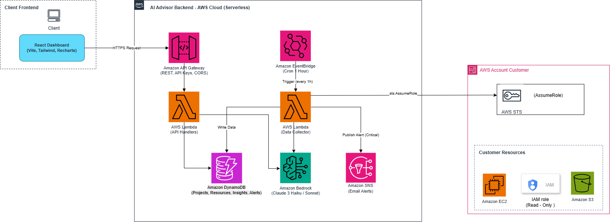
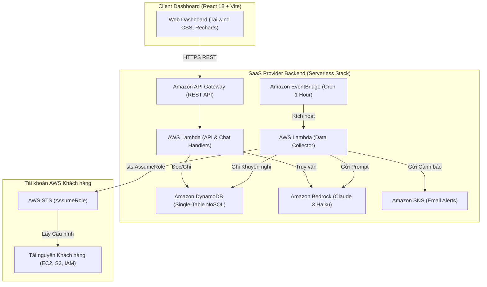

# Đề xuất Đồ án: AI AWS Advisor (Enterprise SaaS)
## Nền tảng Tự động Kiểm toán & Tối ưu hóa Đa tài khoản Đám mây AWS

### 1. Tóm tắt Đề xuất

Dự án **AI AWS Advisor** đề xuất giải pháp xây dựng nền tảng B2B SaaS cấp doanh nghiệp nhằm tự động hóa quy trình kiểm toán hạ tầng đám mây, kiểm tra tuân thủ bảo mật và tối ưu hóa chi phí cho các môi trường đa tài khoản AWS.

Bằng cách kết hợp **Amazon Bedrock (Claude 3 Haiku)** cùng kiến trúc Serverless 100% (**AWS Lambda, Amazon API Gateway, Amazon DynamoDB, Amazon EventBridge**), hệ thống tự động thu thập cấu hình tài nguyên thô, đánh giá rủi ro, tính toán số tiền tiết kiệm và đưa ra khuyến nghị xử lý trực quan qua Web Dashboard và AI Copilot.

---

### 2. Mô tả Bài toán Thực tế

#### Thách thức của Ngành
Các tổ chức vận hành hệ thống trên AWS hiện nay đang đối mặt với 3 thách thức lớn:
1. **Lỗ hổng Bảo mật tiềm ẩn:** Lỗi cấu hình như S3 bucket công khai, Security Group mở `0.0.0.0/0`, hay IAM roles cấp thừa quyền thường khó phát hiện cho đến khi sự cố rò rỉ dữ liệu diễn ra.
2. **Lãng phí Tài nguyên Cloud:** EBS volume không gắn vào máy chủ, EC2 nhàn rỗi, hay Elastic IP không sử dụng gây lãng phí hàng nghìn USD mỗi tháng.
3. **Quy trình Kiểm toán Thủ công Tốn thời gian:** Đội ngũ Security và DevOps phải tốn hàng trăm giờ đọc file JSON cấu hình thô một cách thủ công trên nhiều tài khoản khác nhau.

#### Giải pháp Đề xuất
**AI AWS Advisor** mang đến giải pháp kiểm toán đám mây tập trung, bảo mật Zero-Trust:
- **Ủy quyền Zero-Trust Cross-Account:** Sử dụng dịch vụ AWS STS (`sts:AssumeRole`) cấp quyền truy cập kiểm toán ngắn hạn mà không cần lưu trữ Access Key cố định của khách hàng.
- **Quét Tự động Theo Sự kiện:** EventBridge kích hoạt tiến trình định kỳ hàng giờ để thu thập cấu hình hạ tầng từ tất cả tài khoản đã đăng ký.
- **Động cơ Phân tích Generative AI:** Tích hợp Amazon Bedrock (Claude 3 Haiku) dịch dữ liệu cấu hình thô thành các báo cáo khuyến nghị được phân loại theo **Bảo mật (Security)**, **Tối ưu Chi phí (Cost)**, và **Hiệu năng (Performance)**.
- **AI Copilot Trợ lý Ảo:** Cho phép người dùng hỏi đáp trực tiếp về trạng thái hạ tầng bằng ngôn ngữ tự nhiên.

#### Hiệu quả Kinh tế & Tối ưu (ROI)
- **Tiết kiệm Thời gian:** Giảm hơn 90% thời gian kiểm toán thủ công (từ nhiều ngày xuống còn vài phút).
- **Tối ưu Chi phí:** Phát hiện từ 15% đến 35% chi phí lãng phí hàng tháng cho khách hàng.
- **Chi phí Duy trì Nhàn rỗi xấp xỉ $0:** Hệ thống hoạt động theo mô hình Serverless Pay-per-use, chi phí khi không có người dùng đạt $0.00/tháng.

---

### 3. Kiến trúc Giải pháp



#### Dịch vụ AWS Sử dụng
- **AWS Lambda:** Thực thi các API endpoints, truy vấn AI chat và cron quét dữ liệu.
- **Amazon API Gateway:** Cung cấp endpoint REST bảo mật cho ứng dụng Frontend.
- **Amazon DynamoDB:** Cơ sở dữ liệu Single-Table NoSQL lưu trữ projects, cấu hình và khuyến nghị AI với Partition Key cách ly dữ liệu từng khách hàng.
- **Amazon Bedrock (Claude 3 Haiku):** Động cơ Generative AI phân tích dữ liệu JSON thô thành kế hoạch xử lý.
- **Amazon EventBridge & SNS:** Định kỳ lịch quét hàng giờ và phát thông báo qua Email.
- **AWS STS:** Chức năng ủy quyền tài khoản (`sts:AssumeRole`).

---

### 4. Kế hoạch Triển khai Kỹ thuật

#### Các Giai đoạn Thực hiện
1. **Giai đoạn 1: Bảo mật & Thiết kế Kiến trúc (Tháng 1):** Thiết lập Trust Policy IAM Cross-Account, cấu hình template IaC với AWS SAM CLI và thiết kế Single-Table schema DynamoDB (`PROJECTS`, `RESOURCES`, `INSIGHTS`, `ALERTS`).
2. **Giai đoạn 2: Phát triển Scanner & Tích hợp Bedrock (Tháng 2):** Lập trình bộ thu thập cấu hình bằng `boto3`, viết Prompt Engineering cho Claude 3 trên Bedrock và xây dựng bộ kiểm thử Pytest/Moto.
3. **Giai đoạn 3: Phát triển Dashboard & AI Chatbot (Tháng 3):** Xây dựng giao diện React 18 với Vite, Tailwind CSS và Recharts; tích hợp AI Chatbot Copilot; kiểm thử toàn diện và đóng gói CloudFormation deployment.

---

### 5. Lộ trình & Cột mốc Thực hiện

```
+-------------------------------------------------------------------------+
| Tháng 1: Kiến trúc, Bảo mật Trust Policy, SAM IaC, DynamoDB Schema       |
+-------------------------------------------------------------------------+
                                    |
                                    v
+-------------------------------------------------------------------------+
| Tháng 2: Data Collector Lambda, STS AssumeRole, Bedrock AI Analyzer     |
+-------------------------------------------------------------------------+
                                    |
                                    v
+-------------------------------------------------------------------------+
| Tháng 3: React Dashboard, AI Chatbot UI, Pytest/Vitest, Launch & Demo   |
+-------------------------------------------------------------------------+
```

---

### 6. Ước tính Chi phí (Pricing Estimation)

Chi phí ước tính hàng tháng trên 10 dự án khách hàng quét 1,000 tài nguyên AWS mỗi ngày:

| Dịch vụ AWS | Mức độ Sử dụng | Chi phí Ước tính / Tháng |
| :--- | :--- | :--- |
| **AWS Lambda** | 100,000 requests, 512 MB memory | $0.00 (Free Tier) |
| **Amazon API Gateway** | 50,000 REST requests | $0.05 |
| **Amazon DynamoDB** | On-Demand (2 GB storage, 500k reads/writes) | $0.25 |
| **Amazon Bedrock** | Claude 3 Haiku (1M Input tokens, 200k Output tokens) | $1.20 |
| **Amazon EventBridge & SNS** | 720 triggers/tháng, 100 emails | $0.01 |
| **Tổng Chi phí Ước tính Tháng** | **Serverless Pay-Per-Use** | **~$1.51 / tháng** |

*Tổng Chi phí Hạ tầng Hàng năm:* **~$18.12 USD / năm**.

---

### 7. Đánh giá Rủi ro & Giải pháp Nạp ứng

| Rủi ro Phát hiện | Mức độ | Xảy ra | Giải pháp Giảm thiểu |
| :--- | :--- | :--- | :--- |
| **Giới hạn Rate Limit của Bedrock API** | Trung bình | Thấp | Cấu hình Retry exponential backoff & cache kết quả trên DynamoDB. |
| **Khách hàng Thu hồi Quyền IAM Role** | Cao | Trung bình | Xử lý ngoại lệ `ClientError` khi gọi `sts:AssumeRole` và đánh dấu trạng thái project disconnected. |
| **Hiện tượng Virtual Hallucination của LLM** | Cao | Thấp | Yêu cầu định dạng đầu ra JSON strict schema & sử dụng regex fallback parser trên Python. |
| **Vượt Ngân sách Cloud** | Trung bình | Thấp | Cấu hình AWS Budgets cảnh báo khi ngưỡng đạt $5/tháng & giới hạn tần suất cron. |

---

### 8. Kết quả Kỳ vọng

1. **Hệ thống Kiểm toán Tự động:** Thay thế quy trình rà soát thủ công bằng hệ thống AI kiểm toán định kỳ hàng giờ.
2. **Đảm bảo An toàn Dữ liệu:** Không có rủi ro rò rỉ credential nhờ sử dụng session token ngắn hạn qua `sts:AssumeRole`.
3. **Mẫu Kiến trúc Doanh nghiệp:** Tạo ra blueprint chuẩn cho các sản phẩm B2B SaaS phát triển trên nền tảng Serverless AWS.