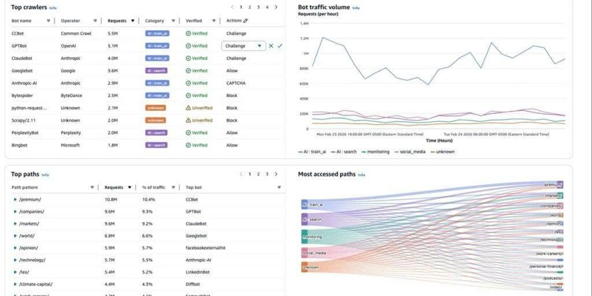

# Exploring AI Traffic Analysis Dashboards in AWS WAF

## Introduction

The rapid growth of AI systems such as **ChatGPT**, **Claude**, and **Perplexity** has changed not only how people search for information but also how websites receive traffic. Today, many AI-powered crawlers visit websites to collect data, making **AI traffic** an increasingly important part of web traffic.

While learning about AWS security services, I came across the AWS Security Blog introducing a new feature called **AI Traffic Analysis Dashboards** for AWS WAF. What caught my attention was not only the dashboard itself but also the problem AWS is trying to solve.

In this blog, I will summarize what I learned from this feature and share my thoughts on why monitoring AI traffic is becoming an important aspect of modern web security.

---

# What is AI Traffic Analysis Dashboards?

Traditionally, web traffic has been categorized into two main groups:

- Human users
- Automated bots

AWS WAF has long been used to identify malicious requests and protect web applications from attacks.

However, with the rise of generative AI platforms such as ChatGPT, Claude, and Perplexity, a new category of traffic has emerged. AI crawlers regularly access websites to gather public information, improve search capabilities, and support AI-generated responses.

Although these requests are not malicious, they still consume computing resources, bandwidth, and infrastructure capacity.

To address this challenge, AWS introduced **AI Traffic Analysis Dashboards**.

---

# What Does AWS WAF Monitor?

According to AWS, the new dashboard allows administrators to identify which AI systems are accessing their applications.

Examples include:

- GPTBot (OpenAI)
- ClaudeBot (Anthropic)
- PerplexityBot
- Googlebot
- Other AI crawlers

Instead of simply showing the total number of requests, the dashboard provides additional insights such as:

- The most active AI crawlers
- Request volume for each bot
- AI traffic trends over time
- The most frequently accessed URLs



*Figure 1. AI Traffic Analysis Dashboard in AWS WAF displaying Top Crawlers, Bot Traffic Volume, Top Paths, and Most Accessed Paths.*

From this dashboard, administrators can quickly understand:

- Which AI bots generate the most traffic
- How AI traffic changes over time
- Which parts of the website receive the highest number of AI requests
- How different AI bots interact with various URLs

This made me realize that AI traffic can significantly impact infrastructure costs without being immediately noticeable.

---

# Bot Identification Is More Complex Than I Expected

Initially, I assumed that identifying AI bots was as simple as checking the **User-Agent** header.

For example:

```text
User-Agent: GPTBot
```

However, AWS explains that User-Agent strings can easily be spoofed.

Instead of relying solely on User-Agent information, AWS WAF Bot Control uses additional verification mechanisms to distinguish legitimate AI crawlers from fake or malicious bots.

This highlights an important security concept: not every request claiming to be GPTBot actually comes from GPTBot.

---

# Which Resources Are AI Crawlers Accessing?

Another feature I found particularly useful is the ability to analyze which URLs receive the most AI traffic.

Typical examples include:

- Blog pages
- Technical documentation
- REST APIs
- Product pages

This information helps operations teams understand which parts of an application attract AI crawlers.

If an internal API receives excessive AI traffic, organizations may decide to:

- Apply rate limiting
- Improve caching mechanisms
- Adjust Bot Control policies

These optimizations can reduce infrastructure costs while maintaining application performance.

---

# Monitoring AI Traffic Over Time

The dashboard also provides historical traffic analysis.

Administrators can monitor:

- Whether AI traffic is increasing or decreasing
- Which AI bots are the most active
- When unusual traffic spikes occur
- Long-term traffic trends

In my opinion, this feature is particularly valuable because unusual traffic patterns are often difficult to identify by examining raw logs alone.

---

# What I Learned

The most interesting takeaway for me is that AWS now treats **AI traffic as a separate category** instead of grouping it together with traditional bots.

When studying web security, most discussions focus on human users and malicious attacks.

Today, AI agents and AI crawlers introduce a completely different type of traffic. Although they are generally not malicious, they still consume infrastructure resources and influence application performance.

As AI technologies continue to evolve, security platforms must also provide better visibility into AI-generated traffic so organizations can better understand and manage their systems.

---

# Conclusion

AI Traffic Analysis Dashboards are **not designed to block AI systems** or prevent them from accessing websites.

Instead, they help organizations:

- Monitor AI traffic
- Analyze AI crawler behavior
- Track traffic trends over time
- Make informed decisions about infrastructure optimization and security policies

From my perspective, this feature demonstrates how cloud security services continue to evolve alongside advances in artificial intelligence.

As AI agents become increasingly common, monitoring AI traffic will likely become a standard practice in web application operations and security.

---

# References

## Original AWS Blog

**Introducing AI Traffic Analysis Dashboards for AWS WAF**

https://aws.amazon.com/blogs/security/introducing-ai-traffic-analysis-dashboards-for-aws-waf/

---

## AWS WAF Documentation

https://docs.aws.amazon.com/waf/

---

## AI Traffic Analysis Dashboards Documentation

https://docs.aws.amazon.com/waf/latest/developerguide/waf-bot-control-ai-traffic.html

---

## Related AWS Services

- AWS WAF
- AWS WAF Bot Control
- Amazon CloudWatch
- AWS Shield
- AWS Firewall Manager

## Related Reading

- **Facebook:** [AI Traffic Analysis Dashboards trong AWS WAF](https://www.facebook.com/groups/660548818043427/user/100038533741109/)

---

# Sources

1. AWS Security Blog. *Introducing AI Traffic Analysis Dashboards for AWS WAF.*

2. AWS Documentation. *AWS WAF Developer Guide.*

3. AWS Documentation. *AI Traffic Analysis Dashboards.*