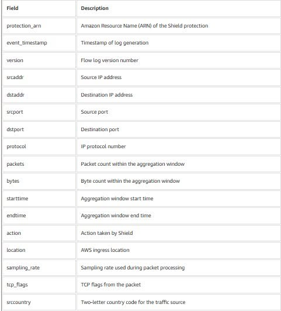

# AWS Shield Advanced Attack Flow Logs Trong Việc Giám Sát Tấn Công DDoS

## Giới thiệu

Trong quá trình tìm hiểu về các dịch vụ bảo mật trên AWS, mình có đọc một bài viết giới thiệu tính năng mới của **AWS Shield Advanced** có tên là **Attack Flow Logs**. Điều khiến mình quan tâm không chỉ là khả năng phát hiện và giảm thiểu các cuộc tấn công DDoS mà còn là cách AWS giúp người quản trị quan sát chi tiết lưu lượng trong suốt quá trình xảy ra tấn công.

Trước đây, khi học về DDoS, mình thường nghĩ rằng mục tiêu quan trọng nhất là phát hiện và chặn lưu lượng độc hại càng sớm càng tốt. Tuy nhiên, sau khi đọc bài viết này mình nhận ra rằng việc thu thập dữ liệu trong quá trình xảy ra tấn công cũng quan trọng không kém. Những dữ liệu này giúp đội ngũ vận hành điều tra sự cố, đánh giá mức độ ảnh hưởng và cải thiện hệ thống phòng thủ cho những lần sau.

---

## AWS Shield Advanced là gì?

**AWS Shield Advanced** là dịch vụ bảo vệ DDoS nâng cao của AWS, được thiết kế để bảo vệ các tài nguyên AWS khỏi các cuộc tấn công ở tầng mạng (Layer 3) và tầng vận chuyển (Layer 4).

Dịch vụ hỗ trợ bảo vệ nhiều tài nguyên quan trọng như:

- Amazon CloudFront
- Elastic Load Balancing (ELB)
- Amazon Route 53
- AWS Global Accelerator
- Elastic IP (EIP)

Ngoài khả năng tự động phát hiện và giảm thiểu các cuộc tấn công DDoS, AWS Shield Advanced còn cung cấp nhiều tính năng giúp phân tích và điều tra sau sự cố.

---

## Attack Flow Logs là gì?

**Attack Flow Logs** là tính năng cho phép ghi nhận metadata của lưu lượng mạng trong thời gian diễn ra cuộc tấn công DDoS.

Thay vì chỉ hiển thị các biểu đồ hoặc số liệu tổng quan, Attack Flow Logs lưu lại nhiều thông tin chi tiết về từng luồng lưu lượng, giúp đội ngũ bảo mật hiểu rõ hơn về đặc điểm của cuộc tấn công.

Các bản ghi có thể được gửi đến:

- Amazon S3
- Amazon CloudWatch Logs
- Amazon Data Firehose

Nhờ đó, dữ liệu có thể dễ dàng tích hợp với các hệ thống giám sát và phân tích hiện có.

---

## Những thông tin được ghi nhận

Attack Flow Logs cung cấp nhiều trường dữ liệu hữu ích giúp mô tả đặc điểm của lưu lượng tấn công, bao gồm:

- ARN của Shield Protection
- Thời gian sinh log
- Địa chỉ IP nguồn và IP đích
- Cổng nguồn và cổng đích
- Giao thức mạng
- Số lượng packet
- Số lượng byte
- Thời gian bắt đầu và kết thúc của phiên ghi nhận
- Hành động mà AWS Shield thực hiện
- AWS Edge Location tiếp nhận lưu lượng
- Tỷ lệ lấy mẫu (Sampling Rate)
- TCP Flags
- Quốc gia phát sinh lưu lượng

Hình dưới đây minh họa một số trường dữ liệu được AWS Shield Advanced ghi nhận trong Attack Flow Logs.

*Hình 1. Một số trường dữ liệu (metadata fields) được AWS Shield Advanced ghi nhận trong Attack Flow Logs.*

Những trường dữ liệu này giúp người quản trị hiểu rõ hơn về nguồn gốc, đặc điểm và quy mô của cuộc tấn công thay vì chỉ xem các số liệu thống kê tổng hợp.

---

## Lợi ích của Attack Flow Logs

### Phân tích lưu lượng tấn công

Attack Flow Logs cho phép xem chi tiết về loại lưu lượng và quy mô của cuộc tấn công thay vì chỉ hiển thị tổng số request.

### Xác định nguồn tấn công

Thông qua địa chỉ IP và quốc gia nguồn, đội ngũ vận hành có thể xác định khu vực phát sinh lưu lượng bất thường để phục vụ điều tra.

### Kiểm tra hiệu quả giảm thiểu

Trường **Action** giúp theo dõi AWS Shield đã xử lý từng luồng lưu lượng như thế nào trong quá trình giảm thiểu cuộc tấn công.

### Tích hợp với các công cụ phân tích

Các bản ghi có thể được sử dụng cùng với:

- Amazon Athena
- CloudWatch Logs Insights
- Amazon OpenSearch Service
- Các hệ thống SIEM như Splunk

Điều này giúp doanh nghiệp tận dụng các công cụ phân tích hiện có mà không cần xây dựng thêm hệ thống thu thập log riêng.

---

## Kiến thức mình học được

Sau khi đọc bài viết, mình nhận ra rằng việc chống DDoS không chỉ dừng lại ở việc phát hiện và ngăn chặn lưu lượng độc hại.

Khả năng quan sát và phân tích lưu lượng trong suốt quá trình xảy ra tấn công cũng rất quan trọng vì nó giúp:

- Đánh giá quy mô của cuộc tấn công.
- Xác định nguồn gốc của lưu lượng bất thường.
- Hiểu rõ cách AWS Shield đã giảm thiểu cuộc tấn công.
- Hỗ trợ điều tra sự cố sau tấn công.
- Rút kinh nghiệm để cải thiện hệ thống bảo mật trong tương lai.

Theo mình, đây là điểm khác biệt đáng chú ý của Attack Flow Logs so với việc chỉ xem các biểu đồ thống kê tổng hợp.

---

## Kết luận

AWS Shield Advanced Attack Flow Logs giúp tăng khả năng quan sát các cuộc tấn công DDoS bằng cách ghi nhận chi tiết metadata của lưu lượng trong thời gian xảy ra tấn công và cho phép xuất dữ liệu đến nhiều dịch vụ AWS để phục vụ việc phân tích.

Đối với mình, đây là một tính năng khá hữu ích vì nó giúp quá trình điều tra sự cố, phân tích lưu lượng và giám sát an ninh trên AWS trở nên trực quan, đầy đủ và hiệu quả hơn.

Nếu doanh nghiệp đã sử dụng AWS Shield Advanced thì Attack Flow Logs là một tính năng rất đáng cân nhắc triển khai nhằm nâng cao khả năng giám sát và điều tra các cuộc tấn công DDoS.

---

# Tài liệu tham khảo

## Bài viết gốc

**Gain visibility into DDoS attacks with flow logs in AWS Shield Advanced**

https://aws.amazon.com/blogs/security/gain-visibility-into-ddos-attacks-with-flow-logs-in-aws-shield-advanced/

---

## AWS Shield Advanced Documentation

https://docs.aws.amazon.com/waf/latest/developerguide/ddos-overview.html

---

## AWS Shield Advanced Attack Flow Logs Documentation

https://docs.aws.amazon.com/waf/latest/developerguide/shield-advanced-logging.html

## Bài viết liên quan

- **Facebook:** [AWS Shield Advanced Attack Flow Logs trong việc giám sát tấn công DDoS](https://www.facebook.com/groups/660548818043427/user/100010448557887)

---

# Các dịch vụ liên quan

- AWS Shield Advanced
- Amazon CloudWatch Logs
- Amazon S3
- Amazon Data Firehose
- Amazon Athena
- Amazon OpenSearch Service

---

# Nguồn tham khảo

1. AWS Security Blog. *Gain visibility into DDoS attacks with flow logs in AWS Shield Advanced.*

2. AWS Documentation. *AWS Shield Advanced Developer Guide.*

3. AWS Documentation. *AWS Shield Advanced Attack Flow Logs.*