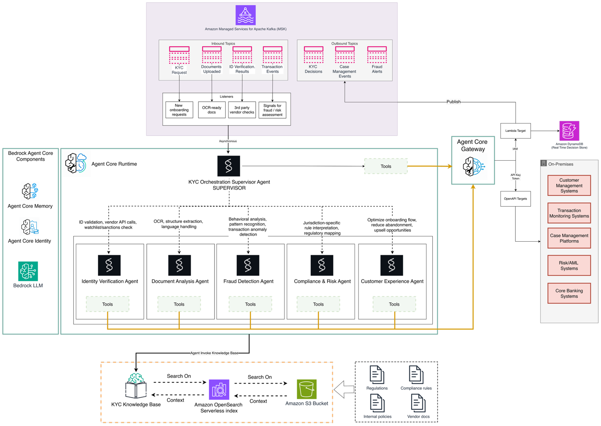

# Modernizing KYC with Serverless & Agentic AI – Những Góc Tối Cần Được Làm Rõ

## Giới thiệu

Trong quá trình tìm hiểu về các kiến trúc hiện đại trong lĩnh vực tài chính, mình có đọc một bài viết trên **AWS Architecture Blog** giới thiệu cách IBM và AWS xây dựng quy trình **Know Your Customer (KYC)** bằng **Serverless**, **Agentic AI**, **Event-Driven Architecture** cùng nhiều dịch vụ AWS.

Điều khiến mình ấn tượng là kiến trúc này không chỉ hướng đến việc tự động hóa quy trình KYC mà còn tận dụng các AI Agent để xử lý từng nghiệp vụ riêng biệt như xác minh danh tính, phân tích tài liệu, phát hiện gian lận và đánh giá rủi ro.

Tuy nhiên, sau khi đọc kỹ hơn, mình nhận thấy bên cạnh những điểm mạnh về mặt kỹ thuật thì vẫn còn khá nhiều vấn đề cần được xem xét dưới góc độ bảo mật, chi phí, khả năng mở rộng và tuân thủ pháp lý.

---

## KYC là gì?

**Know Your Customer (KYC)** là quy trình xác minh danh tính khách hàng mà các ngân hàng và tổ chức tài chính bắt buộc phải thực hiện trước khi cung cấp dịch vụ.

Mục tiêu của KYC là:

- Xác minh danh tính khách hàng.
- Kiểm tra danh sách cấm vận (Sanctions List).
- Đánh giá mức độ rủi ro.
- Phát hiện các giao dịch đáng ngờ.
- Lưu trữ nhật ký phục vụ kiểm toán và thanh tra.

Trong nhiều hệ thống truyền thống, quy trình KYC thường được xử lý theo dạng batch và cần nhiều bước kiểm tra thủ công, khiến thời gian mở tài khoản có thể kéo dài từ vài ngày đến cả tuần.

---

## Kiến trúc được AWS và IBM đề xuất

Kiến trúc được xây dựng theo mô hình **Event-Driven Architecture** kết hợp với **Agentic AI** nhằm xử lý quy trình KYC gần như theo thời gian thực.

Các dịch vụ AWS chính được sử dụng gồm:

- Amazon MSK
- AWS Lambda
- Amazon Bedrock
- Amazon OpenSearch Serverless
- Amazon S3
- Amazon DynamoDB
- AgentCore Gateway
- Amazon CloudWatch
- AWS IAM

Trong đó:

- **Amazon MSK** tiếp nhận và truyền các sự kiện KYC.
- **Supervisor Agent** điều phối toàn bộ quy trình xử lý.
- Các **Sub-Agent** đảm nhiệm từng nghiệp vụ riêng biệt.
- **Knowledge Base** sử dụng OpenSearch Serverless và Amazon S3 để triển khai RAG.
- **AgentCore Gateway** kết nối hệ thống AI với Core Banking và các hệ thống On-Premises.



*Hình 1. Kiến trúc tổng thể của hệ thống KYC sử dụng Event-Driven Architecture kết hợp Agentic AI.*

Sơ đồ trên cho thấy toàn bộ luồng xử lý của hệ thống.

Khi khách hàng gửi yêu cầu KYC, yêu cầu sẽ được đưa vào **Amazon MSK** dưới dạng một sự kiện (Event). Sau đó **Supervisor Agent** tiếp nhận yêu cầu và phân phối công việc đến từng AI Agent chuyên trách.

Các Agent bao gồm:

- **Identity Verification Agent:** Xác minh danh tính khách hàng, kiểm tra giấy tờ và đối chiếu với các nhà cung cấp dịch vụ xác thực.
- **Document Analysis Agent:** OCR, trích xuất thông tin và phân tích nội dung tài liệu.
- **Fraud Detection Agent:** Phát hiện dấu hiệu gian lận hoặc các hành vi bất thường.
- **Compliance & Risk Agent:** Kiểm tra các quy định pháp lý, sanctions list và đánh giá rủi ro.
- **Customer Experience Agent:** Hỗ trợ tối ưu quy trình onboarding và xử lý các bước xác minh bổ sung.

Trong quá trình xử lý, các Agent có thể truy vấn **Knowledge Base** thông qua mô hình **Retrieval-Augmented Generation (RAG)** để lấy các quy định và tài liệu mới nhất trước khi đưa ra quyết định.

Sau khi hoàn thành, kết quả sẽ được gửi tới Core Banking hoặc các hệ thống nghiệp vụ thông qua **AgentCore Gateway**.

---

## Những điểm kiến trúc đáng học hỏi

### Event-Driven Architecture với Amazon MSK

Một trong những điểm nổi bật của kiến trúc là sử dụng **Amazon Managed Streaming for Apache Kafka (Amazon MSK)** để xây dựng hệ thống theo hướng Event-Driven.

Thay vì xử lý KYC theo từng đợt (Batch Processing), mỗi yêu cầu được xem là một sự kiện độc lập.

Điều này mang lại nhiều lợi ích:

- Xử lý gần như theo thời gian thực.
- Giảm thời gian onboarding khách hàng.
- Dễ dàng mở rộng từng thành phần.
- Giảm sự phụ thuộc giữa các dịch vụ.

---

### Multi-Agent Orchestration

Thay vì sử dụng một AI Agent duy nhất, hệ thống chia thành nhiều Agent chuyên trách.

Supervisor Agent sẽ điều phối các Agent và tổng hợp kết quả trước khi đưa ra quyết định cuối cùng.

Quy trình xử lý được mô tả như sau:

```text
Confidence > 95%
        │
        ▼
 Auto Approve

Confidence 75–95%
        │
        ▼
 Additional Verification

Confidence <75%
        │
        ▼
 Human Review
```

Cách phân chia này giúp mỗi Agent chỉ tập trung vào một nhiệm vụ cụ thể, từ đó dễ bảo trì và mở rộng hơn.

---

### RAG với Knowledge Base

Các quy định trong lĩnh vực tài chính thay đổi liên tục.

Để đảm bảo AI luôn sử dụng dữ liệu mới nhất, hệ thống triển khai **Retrieval-Augmented Generation (RAG)**.

Knowledge Base được xây dựng trên:

- Amazon OpenSearch Serverless
- Amazon S3

Các AI Agent sẽ truy xuất tài liệu liên quan trước khi đưa ra quyết định, giúp giảm nguy cơ hallucination của mô hình ngôn ngữ.

---

### AgentCore Gateway

Trong thực tế, nhiều ngân hàng vẫn vận hành Core Banking trên hạ tầng On-Premises.

AgentCore Gateway đóng vai trò cầu nối giữa:

- AI Agents
- Core Banking
- Customer Management Systems
- Risk/AML Systems
- Third-party APIs

Nhờ đó doanh nghiệp có thể hiện đại hóa hệ thống mà không cần thay thế toàn bộ hạ tầng hiện có.

---

## Những vấn đề cần được làm rõ

Mặc dù kiến trúc khá hiện đại nhưng theo mình vẫn còn một số điểm cần được phân tích kỹ hơn.

### Khả năng xử lý các trường hợp đặc biệt

Bài viết đề cập thời gian xử lý KYC dưới 5 phút.

Tuy nhiên chưa làm rõ các trường hợp như:

- Politically Exposed Person (PEP)
- Dual Citizenship
- Rare Jurisdictions
- Thiếu giấy tờ
- Doanh nghiệp có cấu trúc sở hữu phức tạp

Đây đều là những trường hợp thường yêu cầu sự tham gia của chuyên viên kiểm duyệt.

---

### Explainable AI

Bài viết có nhắc đến Explainable AI nhưng chưa giải thích:

- AI đưa ra quyết định dựa trên dữ liệu nào?
- Người kiểm toán có thể kiểm chứng được hay không?
- Có đáp ứng các yêu cầu của EU AI Act hoặc MAS FEAT hay không?

Đây là yêu cầu rất quan trọng đối với các hệ thống AI trong lĩnh vực tài chính.

---

### Các rủi ro bảo mật

Một số mối đe dọa chưa được đề cập nhiều gồm:

- Deepfake Documents
- Synthetic Identity
- Adversarial Attack
- Prompt Injection vào AI Agent

Đặc biệt Prompt Injection hiện đang là một trong những vấn đề lớn đối với các hệ thống Agentic AI.

---

### Chi phí triển khai

Serverless giúp giảm chi phí hạ tầng ở quy mô nhỏ.

Tuy nhiên khi triển khai trên quy mô lớn cần xem xét thêm chi phí của:

- Amazon MSK
- AWS Lambda
- Amazon Bedrock
- OpenSearch Serverless

Ngoài ra còn có các khoản chi phí khác như:

- Migration
- Compliance
- Penetration Testing
- Model Monitoring
- Audit

Đây đều là các chi phí đáng kể trong các dự án tài chính.

---

## Kiến thức mình học được

Sau khi đọc bài viết, mình nhận ra rằng việc xây dựng hệ thống KYC hiện đại không chỉ đơn giản là áp dụng AI mà còn là sự kết hợp của nhiều mô hình kiến trúc khác nhau.

Một số kiến thức mình học được gồm:

- Event-Driven Architecture phù hợp với các hệ thống xử lý khối lượng lớn.
- Multi-Agent giúp chia nhỏ nghiệp vụ và tăng khả năng mở rộng.
- RAG giúp AI luôn sử dụng dữ liệu mới nhất thay vì chỉ dựa trên mô hình đã huấn luyện.
- Explainable AI và Human-in-the-loop là yếu tố rất quan trọng trong các hệ thống tài chính.
- Một kiến trúc tốt không chỉ cần hiệu năng cao mà còn phải đảm bảo khả năng kiểm toán, bảo mật và tuân thủ quy định pháp lý.

---

## Kết luận

Kiến trúc **Modernizing KYC with Serverless & Agentic AI** mang đến nhiều ý tưởng đáng tham khảo trong việc kết hợp Serverless, Event-Driven Architecture và Agentic AI để hiện đại hóa quy trình KYC.

Theo mình, các thành phần như Amazon MSK, AWS Lambda, Amazon Bedrock và RAG là những mô hình kiến trúc rất đáng học hỏi và có thể áp dụng cho nhiều bài toán khác ngoài KYC.

Tuy nhiên, bên cạnh những ưu điểm về mặt kỹ thuật, vẫn còn nhiều vấn đề cần được làm rõ như Explainable AI, bảo mật, Disaster Recovery, chi phí triển khai và trách nhiệm pháp lý khi AI đưa ra quyết định.

Nhìn chung, đây là một kiến trúc có giá trị tham khảo cao nếu đang nghiên cứu về AI trên AWS hoặc xây dựng các hệ thống yêu cầu xử lý khối lượng lớn và tuân thủ nghiêm ngặt các quy định.

---

# Tài liệu tham khảo

## Bài viết gốc

**Modernizing KYC with Serverless & Agentic AI**

https://aws.amazon.com/blogs/architecture/modernizing-kyc-with-serverless-agentic-ai/

---

## AWS Lambda Documentation

https://docs.aws.amazon.com/lambda/

---

## Amazon Bedrock Documentation

https://docs.aws.amazon.com/bedrock/

---

## Amazon MSK Documentation

https://docs.aws.amazon.com/msk/

---

## Amazon OpenSearch Serverless Documentation

https://docs.aws.amazon.com/opensearch-service/latest/developerguide/serverless.html

## Bài viết liên quan

- **Facebook:** [Modernizing KYC with Serverless & Agentic AI](https://www.facebook.com/groups/660548818043427/user/61580015957889/)
---

# Các dịch vụ liên quan

- Amazon MSK
- AWS Lambda
- Amazon Bedrock
- Amazon OpenSearch Serverless
- Amazon S3
- Amazon DynamoDB
- Amazon CloudWatch
- AWS IAM
- AgentCore Gateway

---

# Nguồn tham khảo

1. AWS Architecture Blog. *Modernizing KYC with Serverless & Agentic AI.*

2. AWS Documentation. *Amazon MSK.*

3. AWS Documentation. *Amazon Bedrock.*

4. AWS Documentation. *AWS Lambda.*

5. AWS Documentation. *Amazon OpenSearch Serverless.*