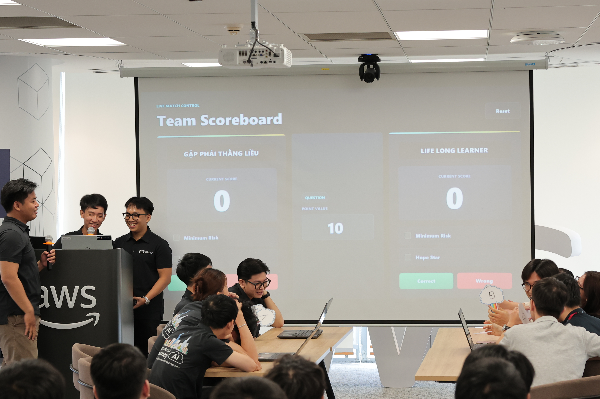
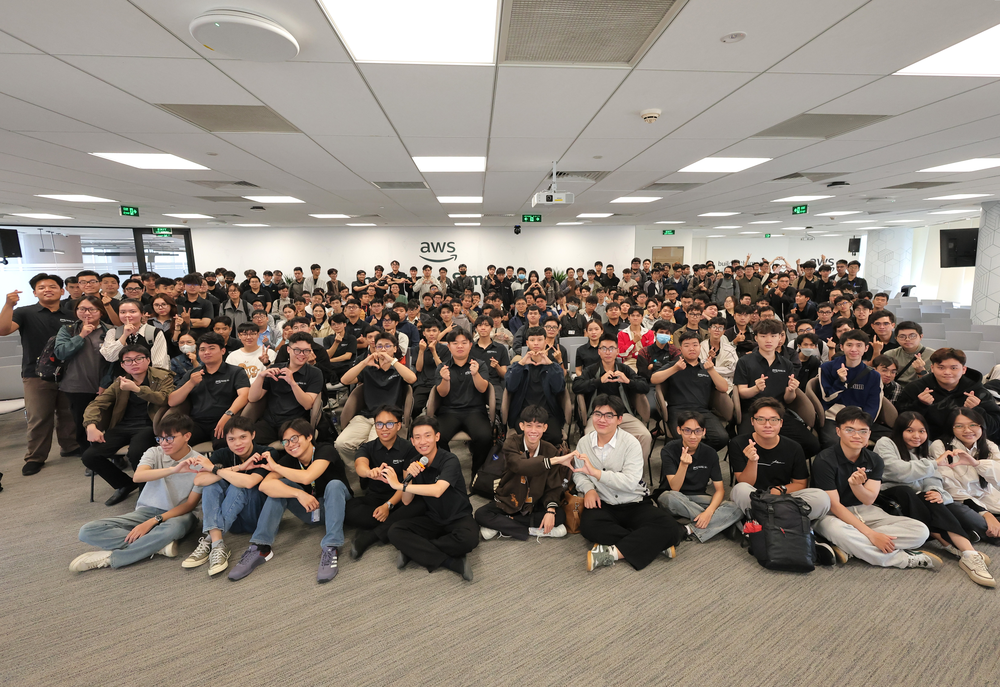

# Bài thu hoạch: Cloud Architect Competition

## Mục đích của sự kiện

Cloud Architect Competition là hoạt động học thuật được tổ chức dành cho các thực tập sinh AWS nhằm tạo sân chơi giao lưu, ôn tập và kiểm tra kiến thức về **Cloud Computing**, **AWS Services** và **Cloud Architecture** thông qua hình thức thi đấu theo đội.

Mục tiêu của sự kiện:

- Củng cố kiến thức về AWS và Cloud Architecture.
- Rèn luyện kỹ năng làm việc nhóm.
- Nâng cao khả năng tư duy và phản xạ khi giải quyết các câu hỏi kỹ thuật.
- Tạo cơ hội giao lưu giữa các nhóm thực tập.

---

## Thông tin sự kiện

| Nội dung | Chi tiết |
|----------|----------|
| **Tên sự kiện** | Cloud Architect Competition |
| **Thời gian** | 20/06/2026 |
| **Địa điểm** | Văn phòng Amazon Web Services (AWS) |
| **Vai trò** | Người tham dự |

---

## Thể lệ cuộc thi

Cuộc thi được tổ chức theo hình thức **đối kháng giữa hai đội**.

Mỗi đội gồm từ **3 đến 5 thành viên**, lần lượt trả lời các câu hỏi trong một bộ đề gồm **10 câu**, với độ khó tăng dần.

Một số điểm nổi bật của cuộc thi:

- Thi đấu theo hình thức loại trực tiếp.
- Mỗi bộ đề gồm 10 câu hỏi.
- Nếu hai đội hòa điểm sẽ có **câu hỏi thứ 11** để phân định thắng thua.
- Đội trả lời đúng và nhanh hơn sẽ giành chiến thắng.

Ngoài ra, mỗi đội còn được sử dụng các kỹ năng đặc biệt trong quá trình thi đấu:

### ⭐ Hope Star (Ngôi sao hy vọng)

- Đúng: Nhân đôi số điểm.
- Sai: Bị trừ gấp đôi số điểm.

### 🛡️ Minimum Risk (Rủi ro tối thiểu)

- Sai: Không bị trừ điểm.
- Đúng: Chỉ nhận 50% số điểm của câu hỏi.

Việc lựa chọn thời điểm sử dụng các kỹ năng này tạo thêm yếu tố chiến thuật và đòi hỏi sự phối hợp giữa các thành viên trong đội.

---

## Nội dung nổi bật

Trong suốt cuộc thi, các câu hỏi tập trung vào nhiều chủ đề liên quan đến AWS và Cloud Computing như:

- AWS Core Services
- Cloud Architecture
- Networking
- Security
- Database
- Storage
- Compute Services
- Best Practices
- Well-Architected Framework

Các đội sẽ thảo luận trong thời gian ngắn trước khi đưa ra đáp án cuối cùng.

Không chỉ cần kiến thức chuyên môn, cuộc thi còn yêu cầu khả năng phân tích nhanh và phối hợp hiệu quả giữa các thành viên.

---

## Những gì mình học được

Sau khi tham gia sự kiện, mình rút ra được nhiều kinh nghiệm cả về kiến thức lẫn kỹ năng.

### Kiến thức chuyên môn

- Ôn tập lại nhiều dịch vụ AWS đã học.
- Hiểu rõ hơn cách áp dụng kiến thức Cloud vào các tình huống thực tế.
- Củng cố kiến thức về thiết kế kiến trúc hệ thống trên AWS.

### Kỹ năng mềm

- Làm việc nhóm dưới áp lực thời gian.
- Thảo luận và thống nhất đáp án nhanh chóng.
- Đưa ra quyết định dựa trên mức độ tự tin của cả đội.
- Phân chia nhiệm vụ theo thế mạnh của từng thành viên.

### Tư duy chiến thuật

Điều mình thấy thú vị nhất là việc sử dụng hai kỹ năng **Hope Star** và **Minimum Risk**.

Đội phải cân nhắc:

- Khi nào nên chấp nhận rủi ro để nhân đôi điểm.
- Khi nào nên chơi an toàn để tránh mất điểm.

Điều này khiến cuộc thi không chỉ kiểm tra kiến thức mà còn đánh giá khả năng phối hợp và đưa ra quyết định.

---

## Trải nghiệm tại sự kiện

Cloud Architect Competition mang đến bầu không khí rất sôi động và hào hứng.

Các đội đều chuẩn bị nghiêm túc và liên tục trao đổi để tìm ra đáp án chính xác trong thời gian giới hạn. Những câu hỏi cuối thường có độ khó cao hơn nên đòi hỏi sự bình tĩnh và phối hợp tốt giữa các thành viên.

Ngoài việc được ôn tập kiến thức, mình còn có cơ hội quan sát cách các đội khác phân tích câu hỏi, đưa ra chiến thuật và sử dụng các kỹ năng đặc biệt. Đây là những kinh nghiệm rất hữu ích trong quá trình học tập cũng như làm việc theo nhóm sau này.

Sự kiện cũng giúp mình giao lưu với nhiều thực tập sinh đến từ các nhóm khác, tạo thêm nhiều mối quan hệ và học hỏi thêm kinh nghiệm từ mọi người.

---

# Hình ảnh tại sự kiện

*Hình 1. Các đội tham gia Cloud Architect Competition tại văn phòng AWS.*

---

## Tổng quan sự kiện 

*Hình 2. Các đội và các anh chị trong buổi sự kiện đó.*

---

## Tổng kết

Cloud Architect Competition không chỉ là một cuộc thi kiến thức mà còn là cơ hội để mình rèn luyện kỹ năng làm việc nhóm, tư duy phản biện và khả năng xử lý tình huống trong thời gian ngắn.

Thông qua sự kiện, mình củng cố thêm kiến thức về AWS, học hỏi được nhiều kinh nghiệm từ các đội khác và có thêm động lực tiếp tục tìm hiểu sâu hơn về Cloud Computing cũng như thiết kế kiến trúc hệ thống trên AWS.