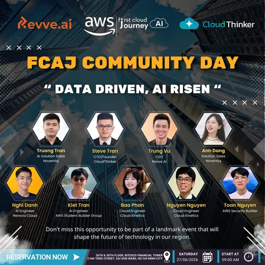
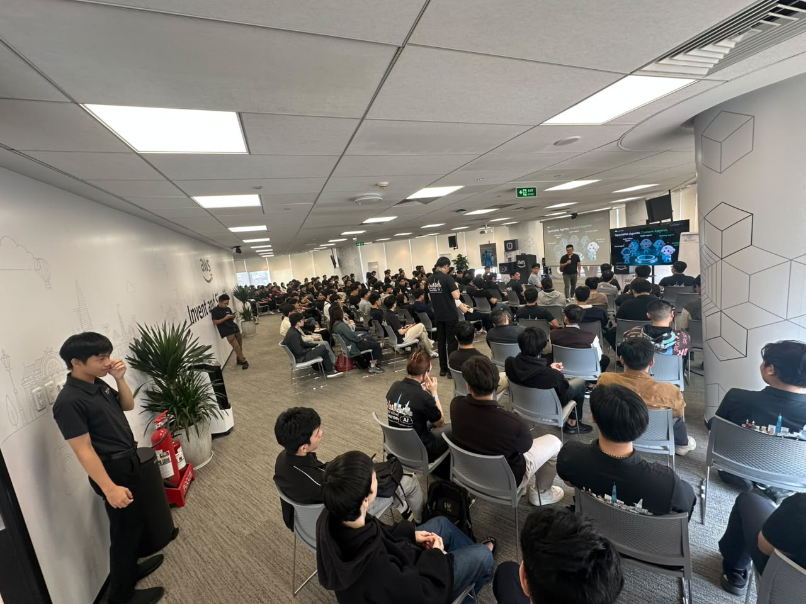

# Bài thu hoạch: AWS First Cloud AI Journey Community Day – June 2026

## Mục đích của sự kiện

**AWS First Cloud AI Journey Community Day – June 2026** là sự kiện do cộng đồng **AWS First Cloud AI Journey** tổ chức nhằm chia sẻ những xu hướng mới nhất về Trí tuệ nhân tạo (AI) và Điện toán đám mây (Cloud Computing). Thông qua các phiên chia sẻ chuyên sâu và demo thực tế, sự kiện giúp người tham gia tiếp cận các công nghệ AI hiện đại đang được ứng dụng trong doanh nghiệp.

Mục tiêu của sự kiện:

- Cập nhật xu hướng mới về AI và Cloud Computing.
- Giới thiệu các ứng dụng thực tiễn của AI trên nền tảng AWS.
- Chia sẻ kinh nghiệm triển khai AI trong doanh nghiệp.
- Tạo cơ hội học hỏi từ các chuyên gia và cộng đồng AWS First Cloud AI Journey.

---

## Thông tin sự kiện

| Nội dung | Chi tiết |
|----------|----------|
| **Tên sự kiện** | AWS First Cloud AI Journey Community Day – June 2026 |
| **Thời gian** | 27/06/2026 |
| **Thời lượng** | 09:00 – 12:00 |
| **Địa điểm** | Bitexco Financial Tower, TP. Hồ Chí Minh |
| **Hình thức tham gia** | Trực tuyến (YouTube Livestream) |
| **Vai trò** | Người tham dự |

---

## Banner sự kiện

*Hình 1. Banner của AWS First Cloud AI Journey Community Day – June 2026.*

---

## Danh sách diễn giả

Sự kiện có sự tham gia chia sẻ của nhiều chuyên gia trong lĩnh vực AI và Cloud:

- **Truong Tran** – AI Solutions, Noventiq
- **Steve Tran** – CTO/Founder, CloudThinker
- **Trung Vu** – CEO, Revve.ai
- **Anh Dang** – Solution Sales, Noventiq
- **Nghi Danh** – AI Engineer, Revnova Cloud
- **Kiet Tran** – AI Engineer, AWS Student Builder Group
- **Bao Phan** – Cloud Engineer, Cloud Kinetics
- **Nguyen Nguyen** – Cloud Engineer, Cloud Kinetics
- **Toan Nguyen** – AWS Security Builder

---

## Nội dung nổi bật

Sự kiện tập trung vào nhiều chủ đề đang được quan tâm trong lĩnh vực AI và Cloud, bao gồm:

- AI Agents
- Voice AI
- DevOps Automation
- MCP Security
- Các ứng dụng AI trên nền tảng AWS

Các diễn giả đã chia sẻ nhiều ví dụ thực tế về cách doanh nghiệp ứng dụng AI để nâng cao hiệu quả vận hành, tự động hóa quy trình và xây dựng các hệ thống hiện đại trên AWS.

Ngoài ra, chương trình còn có các phần **Live Demo**, giúp người tham gia hình dung rõ hơn cách các công nghệ AI được triển khai trong thực tế.

---

## Những gì mình học được

Sau khi theo dõi sự kiện, mình học được nhiều kiến thức mới về AI và các dịch vụ AWS.

### Kiến thức chuyên môn

- Hiểu rõ hơn về AI Agents và khả năng ứng dụng trong doanh nghiệp.
- Tìm hiểu các giải pháp Voice AI.
- Biết thêm về việc ứng dụng AI trong DevOps Automation.
- Hiểu được vai trò của bảo mật trong MCP.
- Tiếp cận nhiều giải pháp AI được xây dựng trên AWS.

### Kiến thức thực tế

- Hiểu rõ hơn xu hướng phát triển AI hiện nay.
- Tiếp cận nhiều ví dụ triển khai AI trong doanh nghiệp.
- Mở rộng góc nhìn về việc kết hợp AI và Cloud để giải quyết các bài toán thực tế.

---

## Trải nghiệm tại sự kiện

Mặc dù tham gia **theo hình thức trực tuyến thông qua YouTube Livestream**, mình vẫn có thể theo dõi đầy đủ các phiên chia sẻ của chương trình.

Các diễn giả trình bày nội dung rõ ràng, kết hợp với nhiều ví dụ và demo thực tế nên rất dễ theo dõi. Điều mình ấn tượng nhất là cách các chuyên gia kết hợp AI với các dịch vụ AWS để xây dựng những giải pháp có tính ứng dụng cao trong doanh nghiệp.

Việc tham gia trực tuyến cũng giúp mình có thể xem lại các nội dung quan trọng sau sự kiện để hiểu rõ hơn những kiến thức được chia sẻ.

---

# Hình ảnh sự kiện

*Hình 2. Không gian diễn ra AWS First Cloud AI Journey Community Day tại văn phòng AWS.*

---

## Tài nguyên sự kiện

**YouTube Livestream**

https://www.youtube.com/live/G8-WlI7f6dE

---

## Tổng kết

AWS First Cloud AI Journey Community Day – June 2026 mang đến cho mình nhiều kiến thức bổ ích về AI và Cloud Computing cũng như các xu hướng công nghệ mới đang được ứng dụng trong doanh nghiệp.

Mặc dù tham gia theo hình thức trực tuyến, mình vẫn có cơ hội học hỏi từ các chuyên gia, tiếp cận nhiều ví dụ thực tế và hiểu rõ hơn cách các dịch vụ AWS có thể kết hợp với AI để xây dựng các giải pháp hiện đại.

Sự kiện cũng tạo thêm động lực để mình tiếp tục nghiên cứu về AI trên AWS, đồng thời mở rộng kiến thức về các công nghệ AI đang phát triển mạnh trong lĩnh vực Cloud Computing.