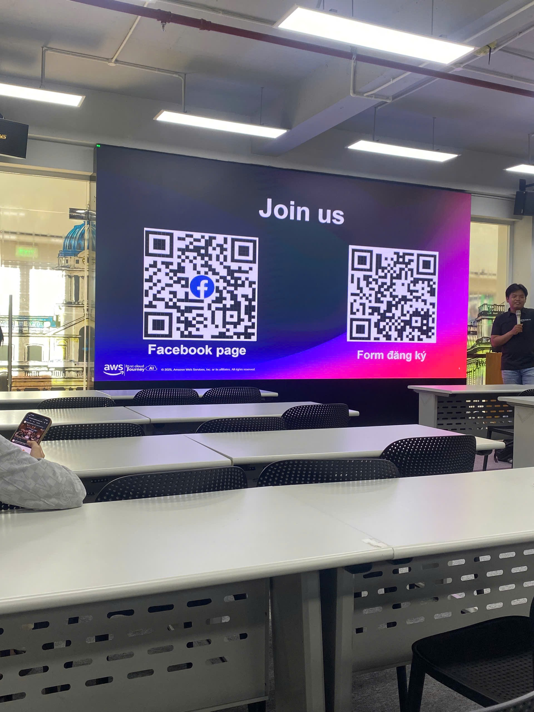

# Event Report: Seminar "AI From Scratch"

## Event Objective

The **"AI From Scratch" Seminar** was organized by the **Office of Corporate Relations**, the **Information Assurance (IA) Department of FPT University Ho Chi Minh City**, in collaboration with **AWS Vietnam**. The seminar aimed to introduce fundamental Artificial Intelligence (AI) concepts, emerging AI trends, and practical AI solutions on the AWS platform. Through technical presentations and live demonstrations, participants gained valuable insights into modern AI technologies and career opportunities in AI and Cloud Computing.

The objectives of the seminar were:

- Introduce the fundamentals of AI and Generative AI.
- Present AI services available on AWS.
- Demonstrate how AI applications can be developed and deployed.
- Help students gain a better understanding of career opportunities in AI and Cloud Computing.

---

## Event Information

| Item | Details |
|------|---------|
| **Event Name** | Seminar "AI From Scratch" |
| **Date** | July 18, 2026 (09:00 – 12:00) |
| **Location** | Room LB24 (2nd Floor), FPT University HCMC Library |
| **Role** | Participant |

---

## Speakers

- **Nguyen Tuan Thinh** – DevOps/Cloud Engineer, AWS Vietnam
- **Nguyen Cong Minh** – DevOps Engineer, AWS Vietnam
- Technical specialists from **AWS Vietnam**

**Academic Supervisor**

- **Mr. Mai Hoang Dinh** – Lecturer, Information Assurance Department, FPT University HCMC

---

## Event Highlights

During the seminar, the speakers shared practical knowledge about Artificial Intelligence and AWS AI services.

Key topics included:

- Introduction to Artificial Intelligence and Generative AI.
- AI Agents and intelligent workflow automation.
- Amazon SageMaker for building, training, and deploying Machine Learning models.
- Amazon Bedrock and Large Language Models (LLMs).
- Guardrails for Amazon Bedrock to improve the safety and reliability of AI applications.
- Deploying AI applications using no-code and low-code approaches for non-technical users.
- Real-world business use cases of AI solutions built on AWS.

The presentations were supported by live demonstrations and practical examples, making it easier for participants to understand how AI applications are developed and deployed in real-world environments.

---

## What I Learned

Attending the seminar provided me with valuable knowledge about Artificial Intelligence and the AWS AI ecosystem.

### Technical Knowledge

- Gained a deeper understanding of AI Agents and how multiple agents can collaborate to solve complex tasks.
- Learned about the role of Amazon SageMaker in building, training, and deploying Machine Learning models.
- Understood how Guardrails for Amazon Bedrock help improve the safety and reliability of AI-powered applications.
- Learned how AI solutions can be deployed for users with little or no programming experience.

### Practical Insights

- Developed a better understanding of the complete AI application development lifecycle.
- Explored real-world AI implementation cases in businesses.
- Learned how AWS provides an integrated ecosystem for developing modern AI applications.

---

## My Experience at the Event

The seminar was held in an engaging and interactive atmosphere, attracting many students interested in Artificial Intelligence and Cloud Computing.

The speakers explained complex concepts in a clear and accessible way while demonstrating practical examples throughout the sessions. I was particularly impressed by the presentations on AI Agents, Amazon SageMaker, and Guardrails for Amazon Bedrock, which provided valuable insights into building secure and production-ready AI applications.

The seminar also gave participants an opportunity to interact directly with AWS engineers and discuss current AI technologies, learning paths, and career opportunities in the cloud industry.

---

## Interactive Activity

At the end of the seminar, the organizers hosted an enjoyable interactive game for participants.

Two players competed against each other using **voice commands** to control characters in a computer game. The game demonstrated how AI-powered speech recognition can be applied in an entertaining and interactive way.

The winner received **a ChatGPT account** as a prize from the organizers.

This activity created an exciting atmosphere and allowed participants to experience a practical AI application beyond the technical presentations.

---

# Event Photos

*Figure 1. The "AI From Scratch" Seminar held at the FPT with participation from AWS Vietnam engineers.*

---

## AWS First Cloud AI Journey Community

*Figure 2. The AWS First Cloud AI Journey Facebook Community, where members can receive event updates, access learning resources, and connect with the community.*

**Join the community:**

https://www.facebook.com/groups/660548818043427/

---

## Conclusion

The **"AI From Scratch" Seminar** provided me with valuable knowledge about Artificial Intelligence, Machine Learning, and AWS AI services.

Through the presentations delivered by AWS experts, I gained a deeper understanding of AI Agents, Amazon SageMaker, Amazon Bedrock, and the technologies that support modern AI application development. The interactive activity at the end of the seminar also gave me the opportunity to experience an engaging real-world AI application.

Overall, the seminar was an inspiring learning experience that motivated me to continue exploring AI technologies on AWS and further develop my skills in Cloud Computing and Artificial Intelligence.