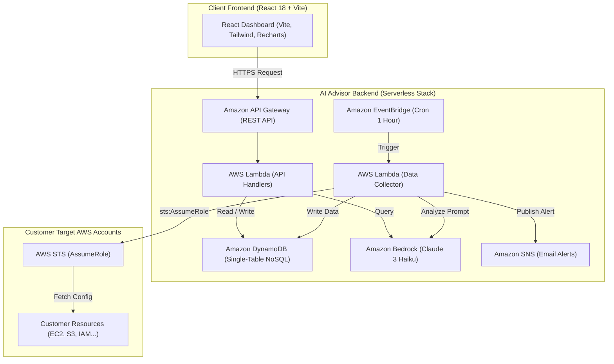
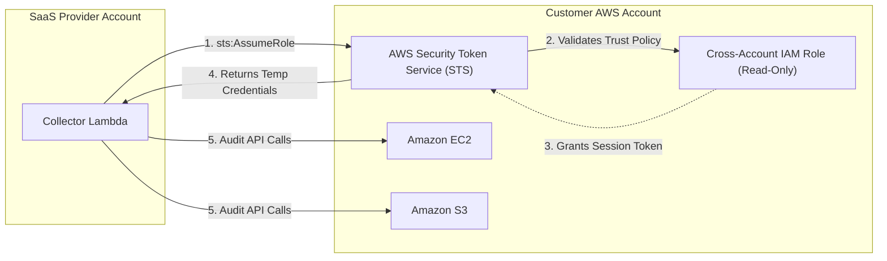
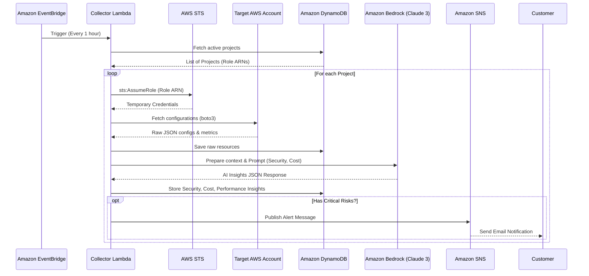
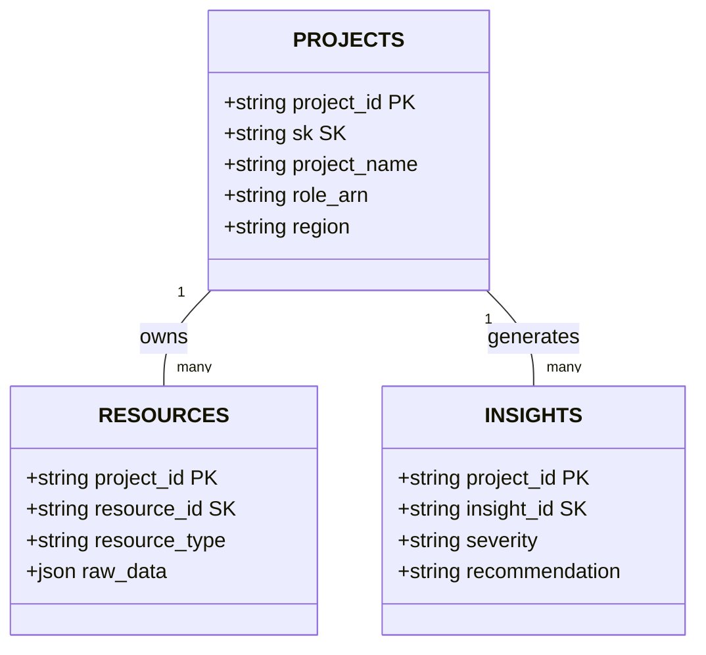

# Section 5.3 - Architecture & Technical Design

The **AI AWS Advisor** project is built upon three core technological pillars: **Serverless Computing**, **Zero-Trust Security**, and **Generative AI**.

---

## 1. High-Level Architecture

The system is partitioned into three independent security boundaries:

### Design Decision: 100% Serverless
Operating on AWS Lambda, API Gateway, and DynamoDB eliminates baseline 24/7 EC2 infrastructure costs, granting zero idle costs and instant scalability.

---

## 2. Zero-Trust Security (Cross-Account Delegation)

Instead of storing customer permanent AWS Access Keys (which introduces massive security risks), the application requires customers to provision a Read-Only IAM Role that trusts our SaaS account.

---

## 3. Automated Scanning & AI Analysis Flow

---

## 4. DynamoDB NoSQL Single-Table Design

The application utilizes Amazon DynamoDB with a Single-Table / Multi-Entity design pattern:

- **PROJECTS:** `PK: project_id`, `SK: METADATA`
- **RESOURCES:** `PK: project_id`, `SK: RESOURCE#<id>`
- **INSIGHTS:** `PK: project_id`, `SK: INSIGHT#<id>`
- **ALERTS:** `PK: project_id`, `SK: ALERT#<id>`

This design provides strict tenant isolation (`project_id` Partition Key) and zero relational migration friction for dynamic AWS JSON configuration schemas.
