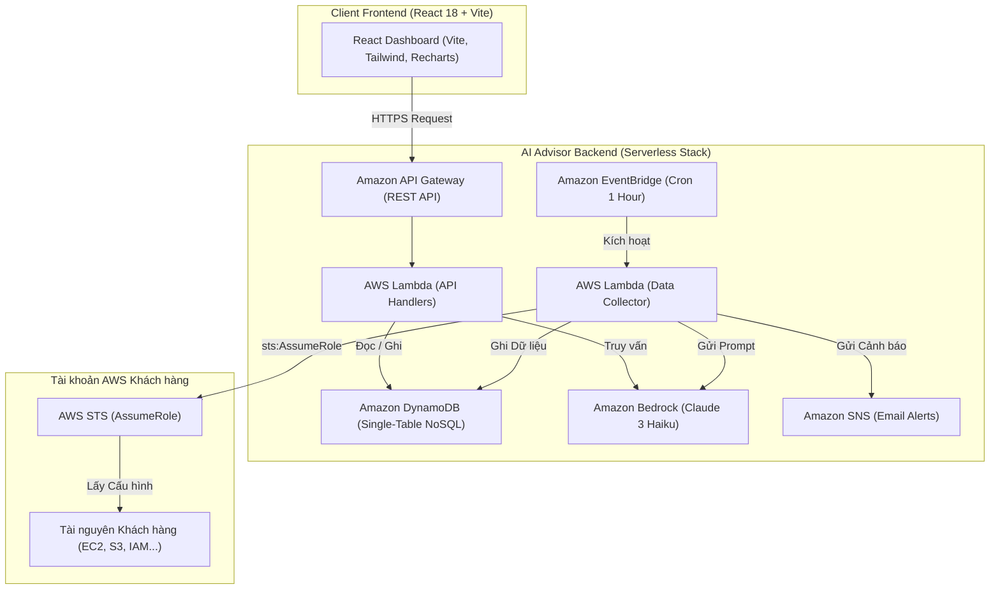
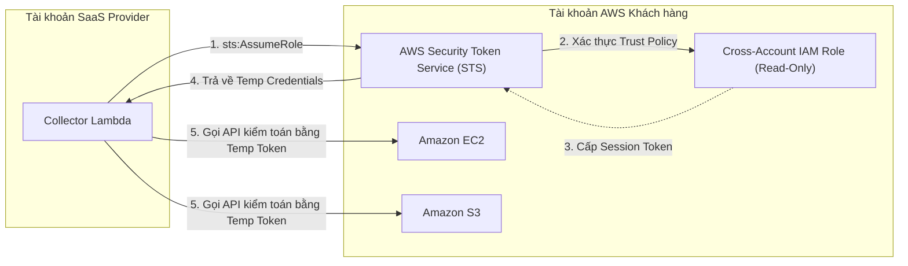
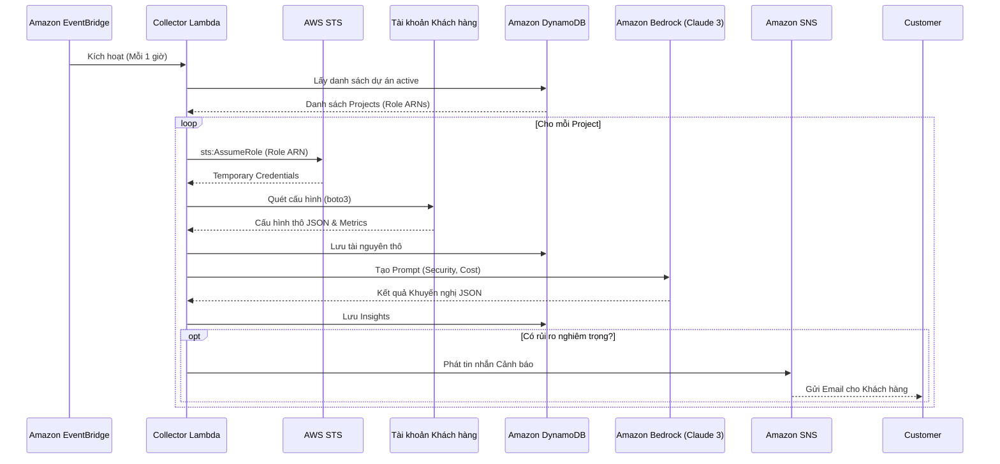
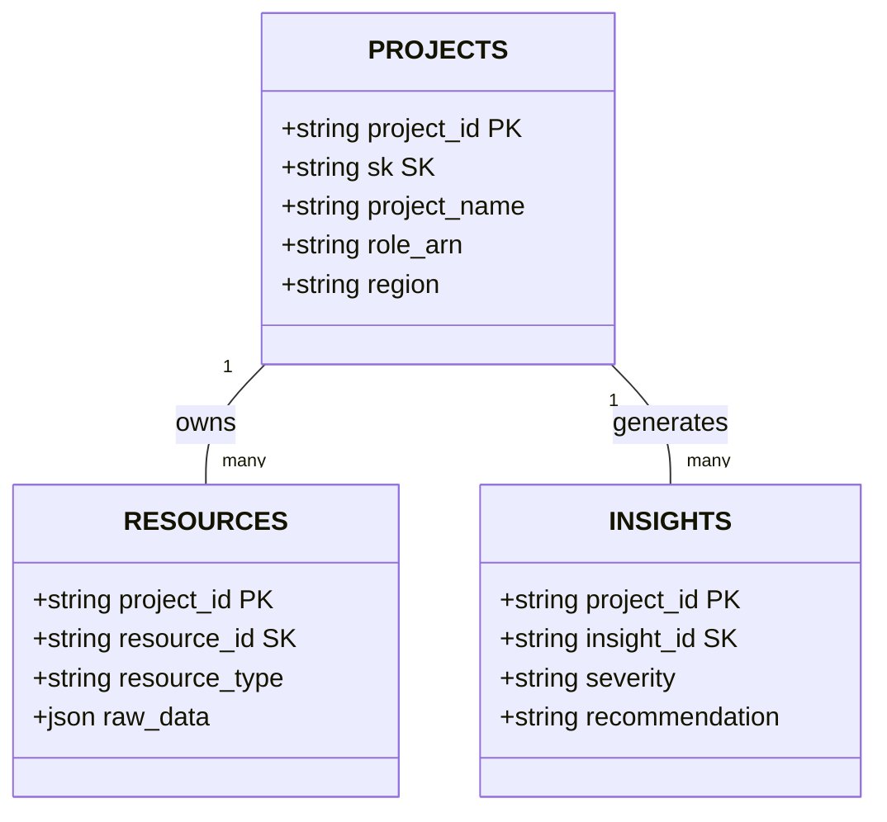

# Phần 5.3 - Kiến trúc & Thiết kế Kỹ thuật

Dự án **AI AWS Advisor** được phát triển trên 3 trụ cột kỹ thuật chính: **Kiến trúc Serverless**, **Bảo mật Zero-Trust**, và **Generative AI**.

---

## 1. Kiến trúc Tổng quan Hệ thống

Hệ thống phân chia ranh giới bảo mật thành 3 vùng độc lập:

---

## 2. Bảo mật Zero-Trust (Cross-Account Delegation)

Thay vì yêu cầu khách hàng cung cấp Access Key / Secret Key cố định (nguy cơ rò rỉ rất cao), hệ thống áp dụng cơ chế ủy quyền ủy thác qua AWS STS:

---

## 3. Luồng Quét Tự động & Phân tích Trí tuệ Nhân tạo

---

## 4. Cơ sở Dữ liệu DynamoDB Single-Table Design

Mô hình thiết kế NoSQL linh hoạt hỗ trợ đa đối tượng:

- **PROJECTS:** `PK: project_id`, `SK: METADATA`
- **RESOURCES:** `PK: project_id`, `SK: RESOURCE#<id>`
- **INSIGHTS:** `PK: project_id`, `SK: INSIGHT#<id>`
- **ALERTS:** `PK: project_id`, `SK: ALERT#<id>`
